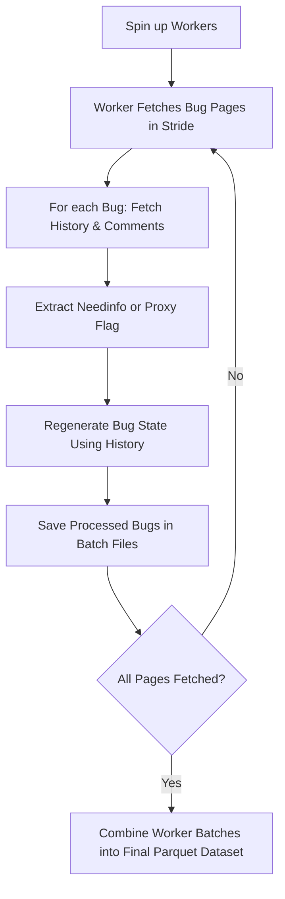
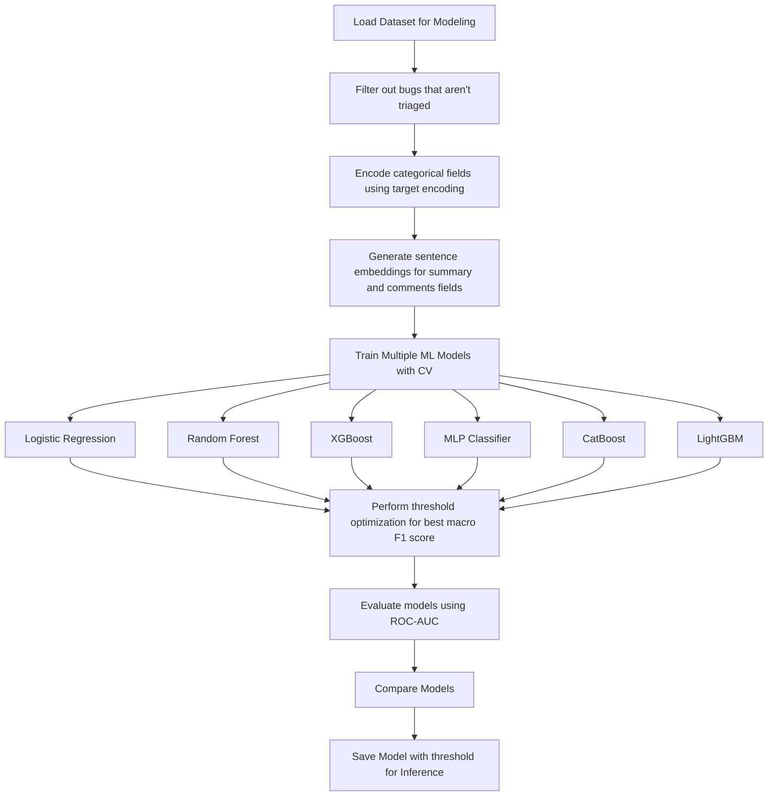

# Bugzilla Bug Clarity Dataset & Model Pipeline

This project implements a **pipeline for creating a Bugzilla bug clarity dataset** and subsequently training machine learning models using it. The pipeline includes:

1. **Dataset Generation** – Fetch, process, regenerate, and store Bugzilla bug data with clarity ground truths or proxies
2. **Model Building** – Train and evaluate lightweight (CPU only) machine learning models using the generated dataset

<br>

Note:
- This pipeline is highly customisable (Bugzilla instance, fields extracted, dataset window, etc.), see Config section
- This pipeline should work for any [Bugzilla project](https://www.bugzilla.org/about/installation-list.html), not just for Mozilla

## Table of Contents

- [Basic Pipeline Setup](#basic-pipeline-setup)
- [Part 1: Dataset Generation](#part-1-dataset-generation)
   - [Diagram Overview](#diagram-overview-1)
   - [Run Commands](#run-commands-1)
- [Part 2: Model Building](#part-2-model-building)
   - [Diagram Overview](#diagram-overview-2)
   - [Run Commands](#run-commands-2)
- [Config](#config)
- [Developer Commands](#developer-commands)


## Basic Pipeline Setup
1. Install UV
2. Install all packages
    ```bash
    uv sync
    ```

3. Dataset Generation
    ```bash
    uv run src/build_dataset/main.py
    ```

4. Build and Save Inference Model
    ```bash
    uv run src/build_model/train_inference_model.py
    ```


## Part 1: Dataset Generation

**Purpose:** Build a structured Bugzilla dataset for clarity prediction.

**Dataset Details:**

- **Ground truth:** `needinfo` flags raised on bugs
- **Bug state regeneration:** For each `needinfo` flag, the bug is rebuilt using its history to reflect its state **at the time the flag was raised**
- **Proxy detection:** For non-Mozilla Bugzilla instances without `needinfo` flags, a proxy is used: the first comment containing `?` by a non-reporter **after the reporter’s comment** is treated as a `needinfo` proxy

**Functionality:**

- Store results in **batches of Parquet files** in a temporary folder
- Merge batches into a single Parquet dataset.
- Supports resumable runs (if error occurs) with progress tracking

### Diagram Overview


### Run Commands

```bash
uv run src/build_dataset/main.py
```
- Rereun to continue progress if worker errored out
- See [config.yaml](src/build_dataset/config.yaml) for custom settings such as which Bugzilla instance to fetch data from, what fields to store, etc.


## Part 2: Model Building

**Purpose:** Train and benchmark multiple ML models for clarity prediction.

**Functionality:**
- Filters out bugs that may not have ground truths yet (<14 days since creation)
- Encodes categorical fields using target encoding
- Generates sentence embeddings for summary and comments fields using `SentenceTransformer`
- Trains multiple classifiers:
  - Logistic Regression
  - Random Forest
  - XGBoost
  - MLP Classifier
  - CatBoost
  - LightGBM
- Performs threshold optimization for best `macro F1 score`
- Evaluates models using `ROC-AUC` and `F1 score`
- Saves best model for inference deployment

### Diagram Overview


### Run Commands
- You can change the path of which dataset is loaded in [global_config.yaml](global_config.yaml)
- See [config.yaml](src/build_model/config.yaml) for options such as which features are used in the model, the `SentenceTransformer` model used, etc.
- Manually tune hyperameters at [models.py](src/build_model/models/models.py)

***Model Benchmarking on all Models with CV***
```bash
uv run src/build_model/benchmark_models.py
```

***Save Selected Model for Inference and Deployment***
```bash
uv run src/build_model/train_inference_model.py
```
- Manually modify code to select which model to use and save 

***Basic EDA***
```bash
uv run src/build_model/inspect_dataset.py
```


## Config
- Each project has a local `config.yaml` config
- The global project has a shared [global_config.yaml](global_config.yaml) config.


## Developer Commands

**Format code**
```bash
uv run ruff format
```

**Lint**
```bash
uv run ruff check
```

**Type Check**
```bash
uv run ty check
```